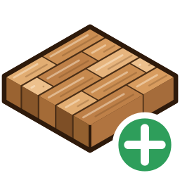

  

<h1 align="center">Generator podłogi deskowanej dla IngeTrazo</h1>

  Parametryczne podłogi z desek, tarasy i parkiety dla <a href="https://github.com/ingelibre/ingetrazo">IngeTrazo</a> –
  zaznacz płaszczyznę, wybierz wzór i gotowe: podłoga z bordiurą, listwami przypodłogowymi i raportem materiałowym.

  <a href="README.md">English</a> · <b>Polski</b>

---

## Co to jest?

`floor_generator.py` to jednoplikowy **plugin (rozszerzenie) do IngeTrazo**. Zamienia dowolną płaską powierzchnię
modelu (podłogę pokoju, taras, balkon…) w prawdziwą podłogę 3D złożoną z pojedynczych desek:

- każda deska to osobna bryła o zadanej grubości i z fugą,
- deski są docinane dokładnie do obrysu pomieszczenia, wokół słupów i otworów,
- można dodać bordiurę (friz) ciętą na miter oraz listwy przypodłogowe,
- plugin liczy, ile materiału kupić (z zapasem na odpad), i eksportuje to do CSV.

Podłoga pozostaje **parametryczna**: zaznacz ją później i zmień wzór, wymiar desek, drewno albo kąt – zostanie
przebudowana w miejscu. Każda operacja to jeden krok Cofnij (`Ctrl+Z`).

## Możliwości

| | |
|---|---|
| 🪵 **11 wzorów ułożenia** | cegiełka 1/2, schodkowy 1/3, losowy, szeregowy, jodełka (1×/2×/3×), jodełka francuska, koszykowy, kasetony wersalskie, szerokości mieszane |
| 📐 **Dowolny obrys** | pomieszczenia wklęsłe / w kształcie L, dowolny kąt ułożenia, wiele płaszczyzn naraz |
| 🕳️ **Słupy i otwory** | otwory w płaszczyźnie oraz mniejsze płaszczyzny zaznaczone wewnątrz pokoju są automatycznie wycinane |
| 🖼️ **Bordiura na miter** | 1–10 desek bordiury wzdłuż ścian i (opcjonalnie) wokół słupów |
| 🧱 **Listwy przypodłogowe** | cięte na miter w narożnikach, wzdłuż ścian i wokół słupów; w kolorze drewna lub białe (RAL 9003) |
| 🎨 **Gatunki drewna i odcienie** | dąb, sosna, orzech, jesion, tek; losowe ±% odcienia każdej deski dla naturalnego wyglądu |
| 📊 **Raport materiałowy** | powierzchnie, liczba desek pełnych / dociętych / bordiury, metry bieżące, długość listew, zalecana ilość do zakupu; eksport CSV |
| ✏️ **Edycja** | zaznacz wygenerowaną podłogę i uruchom narzędzie ponownie, by zmienić dowolny parametr |
| ⚡ **Szybko i lekko** | identyczne deski są współdzielonymi **instancjami komponentów** – tysiące desek bez zacinania przy obracaniu i zaznaczaniu |
| 🏗️ **BIM** | podłoga jest oznaczona jako `IfcCovering` (FLOORING) |
| ↩️ **Cofnij / Ponów** | utworzenie i edycja podłogi to jeden krok historii |
| 🌐 **English / Polski** | przełącznik języka bezpośrednio w oknie |

## Instalacja

1. Pobierz `floor_generator.py` (opcjonalnie też `floor_generator.svg` / `floor_generator.png` – ikona i tak jest
   wbudowana w skrypt, pliki tylko ją nadpisują).
2. Skopiuj plik(i) do folderu pluginów IngeTrazo:
   - **Windows:** `%APPDATA%\ingetrazo\plugins\`
   - **Linux:** `~/.local/share/ingetrazo/plugins/`

   Podpowiedź: w IngeTrazo użyj **Extensions → Open plugins folder**.
3. **Uruchom ponownie IngeTrazo** (pluginy są wczytywane tylko przy starcie).

Po restarcie znajdziesz:

- górny pasek narzędzi **„Floor & Decking”** z ikoną pluginu
  (kliknięcie = generuj / edytuj, mała strzałka = menu z raportem materiałowym),
- **Extensions → Floor & Decking Generator** (skrót `Ctrl+Shift+F`, o ile nie zajmuje go inne narzędzie),
- podmenu **Extensions → Floor & Decking (Podłoga)** z pozycjami *Generate / Edit Floor…* i *Material & Cut Report…*,
- pozycje w menu kontekstowym (prawy przycisk myszy) na zaznaczonych płaszczyznach i na wygenerowanych podłogach.

### Wymagania

- IngeTrazo z Extension API v2 (każda aktualna wersja).
- Żadnych dodatkowych pakietów Pythona. Przycinanie 2D korzysta z `manifold3d`, który jest dostarczany z IngeTrazo;
  gdy go brak, używany jest `shapely`.

## Jak używać

### Tworzenie podłogi

1. Zaznacz **płaszczyznę (Face)** podłogi (jedną lub kilka; każdy osobny obrys dostaje własną podłogę).
2. *Opcjonalnie:* zaznacz też mniejsze płaszczyzny leżące w tej samej płaszczyźnie wewnątrz pokoju – zostaną
   potraktowane jako **słupy / otwory** i wycięte. Otwory istniejące już w płaszczyźnie są wykrywane automatycznie.
3. Kliknij ikonę na pasku (albo menu / `Ctrl+Shift+F` / prawy przycisk → *Generuj podłogę deskowaną…*).
4. Ustaw parametry i potwierdź **OK**.
5. Opcjonalnie otwórz **raport materiałowy** proponowany po wygenerowaniu.

Podłoga powstaje jako grupa *Podłoga deskowana* ułożona na zaznaczonej płaszczyźnie.

### Edycja podłogi

Zaznacz wygenerowaną grupę podłogi i uruchom narzędzie ponownie (albo prawy przycisk → *Edytuj podłogę…*).
Okno otworzy się z zapisanymi parametrami tej podłogi; po **OK** podłoga zostanie przebudowana w miejscu
(zachowuje położenie, nazwę oraz wykonane przesunięcia/obroty).

### Raport materiałowy

Strzałka przy ikonie → *Material & Cut Report…* (albo prawy przycisk na podłodze → *Raport materiałowy…*).
Raport można też otworzyć z okna parametrów przyciskiem *Raport materiałowy i kalkulator…*.

## Opcje

| Opcja | Domyślnie | Zakres | Opis |
|---|---|---|---|
| **Wzór podłogi** | 1/2 (cegiełka) | 11 wzorów | Sposób ułożenia – patrz niżej. |
| **Kąt ułożenia** | 0° | 0–360° | Obrót całego wzoru względem płaszczyzny. |
| **Szerokość deski** | 14 cm | 3–100 cm | Szerokość pojedynczej deski. |
| **Długość deski** | 120 cm | 0–1000 cm | Długość pojedynczej deski. **0 = ciągła** (jedna deska od ściany do ściany). |
| **Grubość (wysokość)** | 20 mm | 2–100 mm | Grubość deski. |
| **Fuga / odstęp** | 3 mm | 0–20 mm | Szczelina między deskami (np. fuga tarasowa). |
| **Bordiura dookoła** | wył. | – | Friz cięty na miter wzdłuż ścian. |
| **Bordiura wokół otworów/słupów** | wł. | – | Obramowanie bordiurą także słupów i otworów. |
| **Liczba desek w bordiurze** | 1 | 1–10 | Liczba rzędów bordiury. |
| **Szerokość deski bordiury** | 14 cm | 3–100 cm | |
| **Listwy przypodłogowe** | wył. | – | Listwy wzdłuż ścian, cięte na miter w narożnikach. |
| **Listwy wokół otworów/słupów** | wł. | – | Listwy także wokół słupów. |
| **Wysokość listwy** | 8 cm | 3–25 cm | |
| **Grubość listwy** | 15 mm | 5–35 mm | |
| **Wykończenie listwy** | w kolorze drewna | drewno / biała RAL 9003 | |
| **Rodzaj drewna** | dąb naturalny | dąb, sosna, orzech, jesion, tek | Kolor bazowy desek. |
| **Zróżnicowanie odcieni** | 6 % | 0–25 % | Losowa zmiana jasności każdej deski (0 = wszystkie identyczne). |
| **Twórz deski jako komponenty** | wł. | – | Identyczne deski współdzielą jedną geometrię (zdecydowanie zalecane – patrz *Wydajność*). |
| **Język** | English | English / Polski | Język okna, raportu i nazw elementów. |

Ostatnio użyte ustawienia są zapamiętywane w dokumencie i proponowane przy kolejnej podłodze.

### Wzory

| Wzór | Opis |
|---|---|
| **1/2 (cegiełka)** | Klasyczne rzędy z łączeniami przesuniętymi o pół deski. |
| **1/3 (schodkowy)** | Łączenia przesunięte o 1/3 deski – efekt „schodków”. |
| **Losowe przesunięcie** | Losowe przesunięcia łączeń, naturalny wygląd podłogi z desek. |
| **Brak (szeregowy)** | Bez przesunięcia – wszystkie łączenia w jednej linii. |
| **Jodełka klasyczna (1×)** | Pojedyncze klepki ułożone pod kątem 90° do siebie. |
| **Jodełka podwójna (2×)** | Pary klepek w jodełkę. |
| **Jodełka potrójna (3×)** | Trójki klepek w jodełkę. |
| **Jodełka francuska (Chevron 45°)** | Klepki z końcami ciętymi pod 45°, łączące się w literę V. |
| **Koszykowy / szachownica** | Kwadraty z desek, naprzemiennie obrócone o 90°. |
| **Kasetony wersalskie** | Klasyczne kwadratowe kasetony pałacowe z krótkich listewek. |
| **Szerokości mieszane (rustykalny)** | Rzędy desek o różnych szerokościach, styl rustykalny. |

**Wskazówka:** do jodełek używaj krótkiej klepki (np. 60 × 10 cm); przy *Długości deski = 0* plugin sam dobierze
sensowną długość.

## Raport materiałowy

| Sekcja | Zawartość |
|---|---|
| Geometria i wzór | powierzchnia netto pomieszczenia, powierzchnia pokryta deskami, wzór, drewno, wymiar deski |
| Otwory i słupy | liczba i powierzchnia odliczonych otworów |
| Deski | deski pełne (niecięte), docięte, bordiura (ściany / wokół otworów), łączna liczba, łączna długość bieżąca, komponenty (instancje / definicje) |
| Listwy | liczba odcinków, łączna długość |
| Zamówienie | zapas na odpad i **zalecana ilość do zakupu** |

Zapas na odpad wg wzoru: szeregowy / 1/2 / 1/3 – **7 %**, losowy / szerokości mieszane – **8 %**,
wersalski – **10 %**, jodełki – **12 %**, chevron – **15 %**; **+3 %**, gdy kąt ułożenia jest różny od 0°.

**Eksportuj do CSV…** zapisuje raport jako CSV w UTF-8 (otwiera się od razu w Excelu / LibreOffice).

## Wydajność

Przy włączonej opcji *Twórz deski jako komponenty* każdy kształt deski występujący co najmniej dwa razy staje się
**jedną definicją komponentu**, a wszystkie takie deski – jej **instancjami**. Dotyczy to także desek obróconych
(jodełka, chevron, wersal) i identycznych docinek. Kolor deski jest zapisany w instancji, więc deski o tym samym
wymiarze, ale innym odcieniu nadal współdzielą jedną geometrię. Zwykłymi grupami zostają tylko elementy unikalne
(zwykle pojedyncze docinki przy ścianach).

W typowym pokoju 8 × 6 m z jodełką oznacza to ok. 50 geometrii zamiast ok. 500 i ok. 10× mniej ścian do
rysowania – model pozostaje płynny nawet przy tysiącach desek.

Wyłącz tę opcję tylko wtedy, gdy potrzebujesz całej podłogi jako jednej zwykłej siatki (np. do dalszego
modelowania jej powierzchni).

## Wskazówki i rozwiązywanie problemów

- **Nie widać paska / pozycji w menu** – sprawdź, czy plik jest w folderze pluginów, i uruchom IngeTrazo ponownie.
  Jeśli plugin nie może się wczytać, IngeTrazo pokazuje go w menu *Extensions* z ostrzeżeniem ⚠, a błąd – w podpowiedzi.
- **Komunikat „Zaznacz płaszczyznę podłogi…”** – nic odpowiedniego nie jest zaznaczone: zaznacz płaszczyznę (tworzenie) albo wygenerowaną grupę podłogi (edycja).
- **„Nie wygenerowano desek”** – obrys jest za mały dla wybranych wymiarów desek / bordiury.
- **Słup nie został wycięty** – zaznacz jego płaszczyznę razem z płaszczyzną pokoju; musi leżeć w tej samej płaszczyźnie i wewnątrz obrysu.
- **Starsze wersje IngeTrazo** – kolor na instancji wymaga nowszego IngeTrazo (`Group.material`). Starsze wersje też
  działają, ale odcień trafia wtedy do geometrii komponentu, więc komponentów jest nieco mniej
  (ustaw *Zróżnicowanie odcieni* na 0 %, aby uzyskać maksimum).

## Licencja

GPL-3.0-or-later – ta sama licencja co IngeTrazo.
